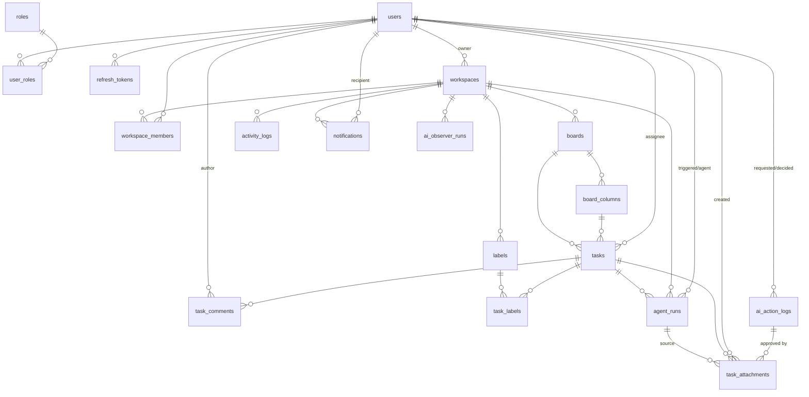

# TeamNexus – Tài liệu Thiết kế Database

> Tài liệu mô tả toàn bộ schema PostgreSQL cho dự án TeamNexus. Phạm vi phủ đủ **7 giai đoạn chức năng** (Auth/RBAC, Kanban real-time, AI Smart Setup, Accountability Layer, AI Observer, Reporting, **AI Agent Executor**).
>
> Các bảng thuộc **Giai đoạn 1 (Auth & Workspace)** được thiết kế chi tiết theo `tasks/phase-1-auth.md`. Các bảng thuộc **Giai đoạn 2–9** là thiết kế sơ bộ, sẽ được tinh chỉnh khi hiện thực từng giai đoạn; mỗi bảng đều gắn nhãn giai đoạn tương ứng theo `03-roadmap.md`.

---

## 1. Tổng quan

| Thành phần | Lựa chọn | Ghi chú |
|---|---|---|
| DBMS | PostgreSQL (Neon hoặc Supabase, serverless) | Free tier — theo dõi quota storage/compute |
| ORM | EF Core Code-First (Npgsql) | Migration bằng `dotnet ef migrations` |
| Kiến trúc | Modular Monolith | Module `Auth`, `Board`, `Ai`, `Reporting` |
| Khóa chính | `Guid` (UUID) cho mọi entity | Sinh ở app layer |
| Quy ước đặt tên | `snake_case` cho bảng/cột | Map từ entity PascalCase qua EF Core config |
| Timestamp | `timestamptz` | `created_at`/`updated_at`; thêm cột riêng ở chỗ cần |
| Enum | Cột `text` + `CHECK` constraint | Map sang .NET enum lưu dạng string; không dùng native ENUM type |
| Soft delete | Cột `deleted_at` (nullable) + global query filter | Cho workspace/board/column/task/comment |
| JSON linh hoạt | `jsonb` | Chỉ cho payload động (AI basis, snapshot, activity payload, tool trace) |
| Binary file | `bytea` | **Chỉ** cho `task_attachments.content` (Giai đoạn 7) — cap 512 KB, không dùng blob/disk/S3 |

### 1.1 DbContext & Migration

Khuyến nghị dùng **một DbContext duy nhất** để giữ **một chuỗi migration**:

```csharp
public class TeamNexusDbContext : IdentityDbContext<ApplicationUser, IdentityRole<Guid>, Guid>
{
    // DbSet cho toàn bộ domain entity
}
```

- Thay thế tên `AuthDbContext` trong `tasks/phase-1-auth.md` §2.1 bằng DbContext hợp nhất `TeamNexusDbContext` (kế thừa `IdentityDbContext`), chứa cả entity Identity lẫn domain entity để tránh cross-context FK và giữ migration đơn giản cho solo/free-tier.
- **Phương án thay thế** (không chọn ở giai đoạn này): mỗi module một DbContext + một "migration context" chung. Tradeoff: tách module sạch hơn nhưng phức tạp quản lý migration và FK giữa các module — chưa cần thiết ở quy mô hiện tại.

### 1.2 Quy ước chung

- Tên bảng/cột viết thường, phân tách bằng `_` (ví dụ `workspace_members`, `created_at`).
- Mọi entity đều có `id` kiểu `uuid` (PK).
- Mọi entity nghiệp vụ (không phải bảng junction thuần) có `created_at`; phần lớn có `updated_at` (đặt tự động ở app layer hoặc `SaveChanges` override).
- Không dùng cascade delete vật lý mặc định ở cấp DB; việc xóa tuân theo soft delete (`deleted_at`) hoặc ràng buộc app layer.
- `jsonb` chỉ dùng cho dữ liệu động; dữ liệu cần truy vấn/lọc phải tách thành cột quan hệ.
- **Phân biệt "người thật" và "AI Agent" (Giai đoạn 7):** `workspace_members.member_type` là dấu hiệu **duy nhất** phân biệt thành viên con người với trợ lý AI. Mọi truy vấn "thành viên" khi cần lọc/tách phải dùng cột này — **không** suy đoán qua tên hiển thị hay qua việc user có `password_hash` hay không.
- **Actor của mọi bản ghi do AI Agent tạo phải nêu rõ:** comment do agent đăng dùng `author_id = agent_user_id` (row `users` thật), hành động ghi dữ liệu dùng `ai_action_logs.requested_by_user_id = agent_user_id`. Nhờ vậy truy vết "việc này do agent hay do người làm" chỉ cần so Guid, không cần bảng ánh xạ.

---

## 2. Sơ đồ quan hệ (ERD)



Quan hệ chính:
- Một `workspace` có nhiều `board`; mỗi `board` thuộc đúng một `workspace`.
- Một `workspace` có nhiều `workspace_members`; vai trò (`Admin`/`Manager`/`Member`) lưu trên từng membership, loại thành viên (`human`/`ai_agent`) lưu trên `member_type`.
- Một `board` có nhiều `board_columns`; mỗi `task` nằm trong một `board_columns` (trạng thái hiện tại). Hai cột mang ngữ nghĩa hệ thống: `is_done` (hoàn thành) và `is_clarification` (Chờ làm rõ — Giai đoạn 7).
- `task` có thể gắn nhiều `labels` qua bảng junction `task_labels`.
- Mọi hành động ghi dữ liệu do AI khởi tạo đều qua `ai_action_logs` (Accountability Layer).
- Mỗi lượt AI Agent thực thi một task là **một row** `agent_runs` (theo dõi tiến trình, **không** phải log quyết định ghi dữ liệu); kết quả dài của agent lưu ở `task_attachments`.

---

## 3. Chi tiết bảng theo module

> Ký hiệu cột: **PK** = khóa chính, **FK** = khóa ngoại, **UQ** = unique, **IX** = index.

### 3.1 Module Auth — Bảng Identity (Giai đoạn 1)

Các bảng Identity của ASP.NET Core được đổi tên sang `snake_case`:

| Tên bảng gốc (Identity) | Tên trong schema |
|---|---|
| `AspNetUsers` | `users` |
| `AspNetRoles` | `roles` |
| `AspNetUserRoles` | `user_roles` |
| `AspNetUserLogins` | `user_logins` |
| `AspNetUserClaims` | `user_claims` |
| `AspNetRoleClaims` | `role_claims` |
| `AspNetUserTokens` | `user_tokens` |

#### `users`
Entity `ApplicationUser` kế thừa `IdentityUser<Guid>`, thêm các field nghiệp vụ.

| Cột | Kiểu | Null | Ràng buộc | Ghi chú |
|---|---|---|---|---|
| `id` | uuid | — | PK | |
| `user_name` | text | — | UQ | Identity chuẩn |
| `normalized_user_name` | text | — | UQ (index) | Identity chuẩn |
| `email` | text | — | UQ | Identity chuẩn |
| `normalized_email` | text | — | UQ (index) | Identity chuẩn |
| `email_confirmed` | bool | — | | Identity chuẩn |
| `password_hash` | text | null | | Identity chuẩn (không dùng cho OAuth-only nhưng giữ chuẩn) |
| `security_stamp` | text | — | | Identity chuẩn |
| `concurrency_stamp` | text | — | | Identity chuẩn |
| `phone_number` | text | null | | Identity chuẩn |
| `phone_number_confirmed` | bool | — | | Identity chuẩn |
| `two_factor_enabled` | bool | — | | Identity chuẩn |
| `lockout_end` | timestamptz | null | | Identity chuẩn |
| `lockout_enabled` | bool | — | | Identity chuẩn |
| `access_failed_count` | int | — | | Identity chuẩn |
| `display_name` | text | — | | Field mở rộng (theo phase-1 §2.1) |
| `avatar_url` | text | null | | Field mở rộng (ảnh từ OAuth provider) |
| `digest_enabled` | boolean | — | default `true` | **Giai đoạn 13.** Bật/tắt email tóm tắt công việc hằng ngày. Nằm ở DB (không phải `localStorage`) vì `DailyDigestRunner` chạy phía server phải **đọc** được lựa chọn. `DEFAULT true` ⇒ mọi row cũ nhận `true`, **không** cần backfill |
| `created_at` | timestamptz | — | | Field mở rộng |

#### `roles`
`IdentityRole<Guid>`.

| Cột | Kiểu | Null | Ràng buộc | Ghi chú |
|---|---|---|---|---|
| `id` | uuid | — | PK | |
| `name` | text | — | UQ | `Admin` / `User` |
| `normalized_name` | text | — | UQ (index) | |
| `concurrency_stamp` | text | — | | |

Seed 2 role khi migrate: `Admin` (system administrator nền tảng) và `User` (default cho mọi user thường đăng ký qua OAuth).

> **Ghi chú thiết kế (Giai đoạn 9 — Đơn giản hóa Role):**
> - **`Admin` (Identity)**: quản trị nền tảng — assign thủ công, không cấp cho user thường. Dùng protect endpoint platform-level (`SystemAdminPolicy`).
> - **`User` (Identity)**: mọi người dùng đăng nhập thành công qua OAuth. Không phản ánh quyền gì trong workspace — quyền workspace do `workspace_members.role` quyết định.
> - Phân quyền nghiệp vụ workspace (tạo board, dùng AI, xem báo cáo...) **không** đọc Identity role — chỉ đọc `workspace_members.role`.
> - **Cũ (Phase 1):** 3 role `Admin`/`Manager`/`Member` — `Manager` và `Member` bị loại bỏ vì chúng không phản ánh quyền thực sự nào; mọi kiểm tra quyền đã dùng `workspace_members.role` từ đầu.


#### `user_roles`
`IdentityUserRole<Guid>`.

| Cột | Kiểu | Null | Ràng buộc | Ghi chú |
|---|---|---|---|---|
| `user_id` | uuid | — | PK (composite), FK→`users` | |
| `role_id` | uuid | — | PK (composite), FK→`roles` | |

#### `user_logins`
`IdentityUserLogin<Guid>` — lưu thông tin đăng nhập ngoài (Google/GitHub).

| Cột | Kiểu | Null | Ràng buộc | Ghi chú |
|---|---|---|---|---|
| `login_provider` | text | — | PK (composite) | `Google` / `GitHub` |
| `provider_key` | text | — | PK (composite) | Sub/ID từ provider |
| `provider_display_name` | text | null | | |
| `user_id` | uuid | — | FK→`users` | |

#### `user_claims`, `role_claims`, `user_tokens`
Giữ cấu trúc chuẩn Identity (`UserClaim`/`RoleClaim`/`UserToken`), đổi tên snake_case. `user_tokens` dùng cho flow password/two-factor nếu cần (không bắt buộc với OAuth-only nhưng giữ chuẩn).

### 3.2 Module Auth — Refresh Token (Giai đoạn 1)

#### `refresh_tokens`

| Cột | Kiểu | Null | Ràng buộc | Ghi chú |
|---|---|---|---|---|
| `id` | uuid | — | PK | |
| `user_id` | uuid | — | FK→`users`, IX | |
| `token_hash` | text | — | | SHA-256 của token thô (không lưu token gốc) |
| `expires_at` | timestamptz | — | | Mặc định 7 ngày |
| `created_at` | timestamptz | — | | |
| `revoked_at` | timestamptz | null | | Set khi revoke (logout/rotate) |
| `replaced_by_token_id` | uuid | null | FK→`refresh_tokens` (self) | Token thay thế trong flow rotate |

> **Ghi chú thiết kế:** dùng `replaced_by_token_id` (self-FK) thay cho field `ReplacedByToken` dạng hash ở `phase-1-auth.md` §2.1 — giúp truy vết chuỗi rotate rõ ràng hơn và chống replay; nếu cần giữ đúng nguyên văn phase-1 có thể thay bằng cột `replaced_by_token` (hash). Rotate = revoke token cũ (`revoked_at`) + tạo token mới trỏ ngược qua `replaced_by_token_id`.

### 3.3 Module Workspace & Membership (Giai đoạn 1)

#### `workspaces`

| Cột | Kiểu | Null | Ràng buộc | Ghi chú |
|---|---|---|---|---|
| `id` | uuid | — | PK | |
| `name` | text | — | | |
| `description` | text | null | | |
| `owner_id` | uuid | — | FK→`users`, IX | Người sở hữu workspace |
| `created_at` | timestamptz | — | | |
| `updated_at` | timestamptz | — | | |
| `deleted_at` | timestamptz | null | | Soft delete |

#### `workspace_members`
Bảng junction giữa workspace và user, mang vai trò **theo từng workspace** (lớp phân quyền thứ hai, song song với Identity role toàn cục).

| Cột | Kiểu | Null | Ràng buộc | Ghi chú |
|---|---|---|---|---|
| `workspace_id` | uuid | — | PK (composite), FK→`workspaces` | |
| `user_id` | uuid | — | PK (composite), FK→`users` | |
| `role` | text | — | CHECK (`role` IN ('Admin','Manager','Member')) | Vai trò trong workspace này |
| `member_type` | text | — | CHECK (`member_type` IN ('human','ai_agent')), default `'human'` | **Giai đoạn 7** — phân biệt thành viên người với trợ lý AI |
| `ai_agent_name` | text | null | | **Giai đoạn 7** — tên hiển thị của agent (null với thành viên người) |
| `joined_at` | timestamptz | — | | |

> **Mô hình phân quyền hai lớp:** `roles` + `user_roles` (Identity) quản lý vai trò **toàn cục** đưa vào claim JWT cho Policy-based authorization; `workspace_members.role` quản lý vai trò **trong phạm vi workspace** (một user có thể là `Admin` ở workspace A nhưng chỉ là `Member` ở workspace B). Composite PK đảm bảo một user chỉ có một vai trò duy nhất trong một workspace.
>
> **Ghi chú tinh chỉnh (Giai đoạn 7 — chốt ở bước lập kế hoạch, chi tiết `tasks/phase-7-ai-agent-executor.md` §0 D1):**
> - **AI Agent là một "pseudo-member" có row `users` thật.** Không thể tránh: `tasks.assignee_id` FK→`users` và `task_comments.author_id` FK→**NOT NULL** `users`, nên nếu agent không phải user thật thì phải sửa `Guid` → kiểu mới ở cả 3 module đồng thời. `member_type` là **discriminator nhỏ nhất** giúp UI/API phân biệt agent với người thật.
> - **Agent là 1 user riêng cho MỖI workspace**, sinh **lazy** ở lần đầu một task được gán cho agent trong workspace đó. Lý do bắt buộc: composite PK `(workspace_id, user_id)` ⇒ một user chỉ thuộc **một** workspace; nếu dùng chung 1 user toàn cục thì agent không thể là thành viên của nhiều workspace cùng lúc.
> - **Partial unique index** `uq_workspace_members_ai_agent` trên `workspace_id` **WHERE** `member_type = 'ai_agent'` ⇒ mỗi workspace có **đúng một** agent. Luôn tìm agent qua `member_type`, **không** qua `ai_agent_name` (tên có thể bị đổi).
> - **Agent là user "ảo", không thể đăng nhập:** row `users` của agent sinh với `email = null`, `password_hash = null`, `lockout_enabled = true`, `two_factor_enabled = true`, và **không** có `user_logins`. Đây là ràng buộc **bảo mật**, không phải chi tiết kỹ thuật.
> - `role` của agent: `Member` — agent **không** phải Manager/Admin; quyền ghi dữ liệu thật đi qua Accountability Layer và do con người duyệt, không qua `role`.

#### `workspace_invitations`
Lời mời tham gia workspace qua email — **Giai đoạn 11**. Khi Manager/Admin mời người dùng mới, một row được tạo ở trạng thái `Pending`; người nhận click link để `Accept`; link hết hạn hoặc bị hủy thì `Expired`/`Cancelled`.

| Cột | Kiểu | Null | Ràng buộc | Ghi chú |
|---|---|---|---|---|
| `id` | uuid | — | PK | |
| `workspace_id` | uuid | — | FK→`workspaces`, IX | |
| `invited_email` | text | — | IX `(workspace_id, invited_email)` WHERE status='Pending' | Email người được mời |
| `invited_role` | text | — | CHECK (`invited_role` IN ('Admin','Manager','Member')), default `'Member'` | Role sẽ nhận khi accept |
| `token_hash` | text | — | UQ | SHA-256 của token thô gửi qua email (không lưu token gốc) |
| `invited_by_user_id` | uuid | — | FK→`users`, IX | Manager/Admin tạo lời mời |
| `status` | text | — | CHECK (`status` IN ('Pending','Accepted','Cancelled','Expired')), default `'Pending'` | Trạng thái lời mời |
| `expires_at` | timestamptz | — | | Mặc định 7 ngày từ lúc tạo |
| `accepted_by_user_id` | uuid | null | FK→`users` | Set khi người nhận accept (user đã tồn tại hoặc mới đăng ký) |
| `accepted_at` | timestamptz | null | | |
| `created_at` | timestamptz | — | | |

> **Ghi chú thiết kế:**
> - **Partial unique index** trên `(workspace_id, invited_email)` WHERE `status = 'Pending'` — đảm bảo không có 2 lời mời đang chờ cùng một email cho cùng workspace.
> - **Token thô** gửi qua email, lưu dạng SHA-256 hash — giống pattern `refresh_tokens.token_hash`.
> - **Luồng accept:** người nhận click link `/invitations/accept?token=...` → hệ thống hash token, tìm row `Pending` chưa expire → tạo row `workspace_members` với `invited_role` → set `status = 'Accepted'`, `accepted_by_user_id`, `accepted_at`. Nếu email chưa có tài khoản thì redirect sang đăng nhập/đăng ký OAuth trước.
> - **Expiry:** BackgroundService (hoặc kiểm tra lazy khi accept) set `status = 'Expired'` cho các row `Pending` đã quá `expires_at`.

### 3.4 Module Kanban — Board (Giai đoạn 2)

#### `boards`

| Cột | Kiểu | Null | Ràng buộc | Ghi chú |
|---|---|---|---|---|
| `id` | uuid | — | PK | |
| `workspace_id` | uuid | — | FK→`workspaces`, IX | |
| `name` | text | — | | |
| `description` | text | null | | |
| `created_at` | timestamptz | — | | |
| `updated_at` | timestamptz | — | | |
| `deleted_at` | timestamptz | null | | Soft delete |

#### `board_columns`
Cột Kanban (trạng thái) của một board.

| Cột | Kiểu | Null | Ràng buộc | Ghi chú |
|---|---|---|---|---|
| `id` | uuid | — | PK | |
| `board_id` | uuid | — | FK→`boards`, IX | |
| `name` | text | — | | Ví dụ: To Do / In Progress / Done |
| `position` | int | — | UQ `(board_id, position)` | Thứ tự hiển thị cột |
| `is_done` | boolean | — | default false | Cột "hoàn thành": task vào đây được set `completed_at` |
| `is_clarification` | boolean | — | default false | **Giai đoạn 7** — cột "Chờ làm rõ", nơi AI Agent tạm dừng task để hỏi lại trưởng nhóm |
| `created_at` | timestamptz | — | | |
| `updated_at` | timestamptz | — | | |

> **Ghi chú tinh chỉnh (Giai đoạn 7 — `tasks/phase-7-ai-agent-executor.md` §0 D3):**
> - Trạng thái Kanban **là cột**, không phải enum trên `tasks` (`tasks.column_id` mới là "trạng thái hiện tại"). `is_clarification` đi đúng đường của tiền lệ `is_done` (thêm ở Giai đoạn 2 bằng migration `Phase2BoardColumnIsDone`) — **không** thêm enum `TaskStatus` để tránh hai nguồn sự thật với `column_id`.
> - **Partial unique index** `uq_board_columns_clarification` trên `board_id` **WHERE** `is_clarification` ⇒ tối đa **một** cột "Chờ làm rõ" mỗi board.
> - Cột được **tạo lazy** ở lần đầu Agent cần (không auto-seed cho board cũ, không bắt mọi board phải có), đặt ở `position = max + 1`, và **không cho xoá** (kể cả khi rỗng) vì hệ thống phụ thuộc vào nó.
> - `is_done` và `is_clarification` **loại trừ nhau**: app layer từ chối bật đồng thời (400). Cột `is_clarification` **không** được coi là "done" khi tính `completed_at` hay thống kê báo cáo.

#### `tasks`

| Cột | Kiểu | Null | Ràng buộc | Ghi chú |
|---|---|---|---|---|
| `id` | uuid | — | PK | |
| `board_id` | uuid | — | FK→`boards`, IX | Để nhóm SignalR theo board & truy vấn nhanh |
| `column_id` | uuid | — | FK→`board_columns`, IX | Trạng thái hiện tại của task |
| `title` | text | — | | |
| `description` | text | null | | |
| `position` | int | — | IX `(board_id, column_id, position)` | Thứ tự task trong cột |
| `assignee_id` | uuid | null | FK→`users`, IX | Người phụ trách (MVP: 1 assignee). **Giai đoạn 7:** có thể là AI Agent (`workspace_members.member_type = 'ai_agent'`) |
| `due_date` | timestamptz | null | | Hạn hoàn thành |
| `priority` | text | null | CHECK (`priority` IN ('Low','Medium','High','Urgent')) | Độ ưu tiên |
| `created_by` | uuid | — | FK→`users` | Người tạo task |
| `created_at` | timestamptz | — | | |
| `updated_at` | timestamptz | — | | |
| `completed_at` | timestamptz | null | | Set khi task vào cột Done |
| `deleted_at` | timestamptz | null | | Soft delete |

> **Ghi chú thiết kế:**
> - Giữ cả `board_id` (cho SignalR group theo board + query theo board) lẫn `column_id` (trạng thái hiện tại). Tính nhất quán (`task.board_id == task.column.board_id`) do app layer đảm bảo.
> - MVP dùng **một assignee** (`assignee_id`). Hỗ trợ đa người phụ trách (bảng `task_assignees`) để dành giai đoạn sau nếu cần.
> - Cập nhật đồng thời chấp nhận chiến lược **last-write-wins** (theo `02-tech-stack-decisions.md` §2.2).

#### `labels`
Nhãn gắn cho task, phạm vi theo workspace.

| Cột | Kiểu | Null | Ràng buộc | Ghi chú |
|---|---|---|---|---|
| `id` | uuid | — | PK | |
| `workspace_id` | uuid | — | FK→`workspaces`, UQ `(workspace_id, name)` | |
| `name` | text | — | | |
| `color` | text | — | | Mã màu (hex, ví dụ `#3B82F6`) |
| `created_at` | timestamptz | — | | |

#### `task_labels`
Junction giữa task và label.

| Cột | Kiểu | Null | Ràng buộc | Ghi chú |
|---|---|---|---|---|
| `task_id` | uuid | — | PK (composite), FK→`tasks` | |
| `label_id` | uuid | — | PK (composite), FK→`labels` | |

#### `task_comments`
Bình luận trên task — đồng thời là nguồn "bối cảnh giao tiếp" cho AI Observer.

| Cột | Kiểu | Null | Ràng buộc | Ghi chú |
|---|---|---|---|---|
| `id` | uuid | — | PK | |
| `task_id` | uuid | — | FK→`tasks`, IX | |
| `author_id` | uuid | — | FK→`users`, IX | **Giai đoạn 7:** câu hỏi của AI Agent cũng là comment với `author_id = agent_user_id` |
| `content` | text | — | | |
| `created_at` | timestamptz | — | | |
| `updated_at` | timestamptz | — | | |
| `deleted_at` | timestamptz | null | | Soft delete |

### 3.5 Module AI — Accountability Layer (Giai đoạn 4)

#### `ai_action_logs`
Vết dữ liệu cho **mọi hành động AI ghi dữ liệu** (theo `02` §2.4 và `03-roadmap.md` giai đoạn 4).

| Cột | Kiểu | Null | Ràng buộc | Ghi chú |
|---|---|---|---|---|
| `id` | uuid | — | PK | |
| `action` | text | — | | Loại hành động (xem bộ giá trị gợi ý ở §4) |
| `entity_type` | text | — | | Loại entity bị tác động (`Board` cho hành động theo lô như `CreateSubtasks`; `Task` cho hành động trên một task) |
| `entity_id` | uuid | null | | Id entity bị tác động (nếu đã sinh) |
| `basis` | jsonb | — | | Tóm tắt prompt/dữ liệu đầu vào (cơ sở của hành động) |
| `before_snapshot` | jsonb | null | | Dữ liệu trước khi áp dụng (dùng để revert/undo) |
| `after_snapshot` | jsonb | null | | Dữ liệu đề xuất (sẽ áp dụng khi được duyệt) |
| `applied_snapshot` | jsonb | null | | Dữ liệu **đã ghi thật** khi `Approved` (danh sách task/label id đã tạo + warnings) — cơ sở để `Undone` revert chính xác |
| `status` | text | — | CHECK (`status` IN ('Pending','Approved','Rejected','Undone')) | Trạng thái vòng đời |
| `requested_by_user_id` | uuid | — | FK→`users`, IX | Người khởi tạo yêu cầu AI |
| `decided_by_user_id` | uuid | null | FK→`users` | Người duyệt/từ chối/undo |
| `decided_at` | timestamptz | null | | Thời điểm ra quyết định |
| `decision_note` | text | null | | Lý do từ chối/hoàn tác (tuỳ chọn, ≤ 500 ký tự) |
| `created_at` | timestamptz | — | | |
| `updated_at` | timestamptz | — | | |

> **Luồng:** AI tạo log ở trạng thái `Pending` (chưa ghi dữ liệu thật) → người dùng `Approved` (áp dụng `after_snapshot`, lưu vết dữ liệu đã ghi vào `applied_snapshot`) hoặc `Rejected` → sau này có thể `Undone` (revert `applied_snapshot`, hoặc về `before_snapshot` nếu có). Mọi hành động AI ghi dữ liệu phải đi qua service `AiActionService` duy nhất.
>
> **Quy ước định vị log (Giai đoạn 4):** hành động `CreateSubtasks` lưu `entity_type = 'Board'` và `entity_id = boardId`, nhờ đó liệt kê lịch sử hành động AI theo board chỉ cần lọc `(entity_type, entity_id)` — **không** cần thêm cột `workspace_id`. Index `(entity_type, entity_id, created_at)` phục vụ truy vấn này (xem §5).
>
> **Ghi chú tinh chỉnh:** hai cột `applied_snapshot` và `decision_note` được bổ sung khi hiện thực Giai đoạn 4 (theo tinh thần "thiết kế sơ bộ, sẽ tinh chỉnh khi hiện thực" ở đầu tài liệu): `applied_snapshot` tách bạch "đề xuất" (`after_snapshot`) khỏi "đã ghi thật" nên Undo không phải suy diễn từ đề xuất; `decision_note` lưu lý do từ chối/hoàn tác cho mục đích giải trình. Chi tiết quyết định xem `tasks/phase-4-accountability-layer.md` §0.
>
> **Quy ước định vị log mở rộng (Giai đoạn 7):** hai hành động mới `PostComment` (kết quả ngắn) và `PostAttachment` (kết quả dài dưới dạng file) lưu `entity_type = 'Task'` và `entity_id = taskId`. `requested_by_user_id` = **`agent_user_id`** (actor thật sự khởi tạo hành động — đúng `04` §1.2 "actor của bản ghi do AI tạo phải nêu rõ"), `decided_by_user_id` = Manager/Admin duyệt. Truy vấn lịch sử theo task dùng **đúng** index sẵn có `(entity_type, entity_id, created_at)` ⇒ **không** cần index mới cho `ai_action_logs`.
>
> **Không cần cột mới cho Giai đoạn 7:** `basis` giữ tóm tắt input (id task + số tool-call + token đã dùng, **không** dump prompt); `after_snapshot` giữ nội dung đề xuất (comment hoặc base64 của file, đã cap); `applied_snapshot` giữ `commentId`/`attachmentId` thật để Undo revert chính xác. Cả hai applier mới tái dùng **nguyên** vòng đời `Pending → Approved/Rejected → Undone` và cơ chế CAS chống duyệt trùng của Giai đoạn 4.

### 3.6 Module AI — Observer (Giai đoạn 5)

#### `activity_logs`
Nguồn "log hệ thống" cho Observer quét định kỳ.

| Cột | Kiểu | Null | Ràng buộc | Ghi chú |
|---|---|---|---|---|
| `id` | uuid | — | PK | |
| `workspace_id` | uuid | — | FK→`workspaces`, IX `(workspace_id, created_at)` | |
| `board_id` | uuid | null | FK→`boards` | |
| `user_id` | uuid | null | FK→`users` | Actor (nếu có) |
| `entity_type` | text | — | | Loại entity (ví dụ `Task`, `Comment`) |
| `entity_id` | uuid | null | | Id entity |
| `action` | text | — | | `TaskCreated` / `TaskUpdated` / `TaskMoved` / `TaskCompleted` / `TaskDeleted` / `CommentAdded` |
| `payload` | jsonb | null | | Chi tiết sự kiện (trạng thái trước/sau, …) |
| `created_at` | timestamptz | — | | |
| `updated_at` | timestamptz | — | | Stamp tự động qua `IAuditableEntity` (append-only ⇒ không mang thông tin) |

#### `notifications`
Cảnh báo gửi **riêng cho Manager** (không public toàn team).

| Cột | Kiểu | Null | Ràng buộc | Ghi chú |
|---|---|---|---|---|
| `id` | uuid | — | PK | |
| `workspace_id` | uuid | — | FK→`workspaces` | |
| `recipient_user_id` | uuid | — | FK→`users`, IX `(recipient_user_id, is_read)` | Manager nhận cảnh báo |
| `type` | text | — | | `Bottleneck` / `Overload` / `ConflictPotential` / `OverdueTask` / … |
| `title` | text | — | | |
| `message` | text | — | | |
| `payload` | jsonb | null | | Chi tiết cảnh báo (danh sách task/user liên quan, …) |
| `is_read` | bool | — | default false | |
| `created_at` | timestamptz | — | | |
| `read_at` | timestamptz | null | | |

#### `ai_observer_runs`
Ghi lại mỗi lần chạy nền của Observer (chống cảnh báo trùng lặp, phục vụ audit).

| Cột | Kiểu | Null | Ràng buộc | Ghi chú |
|---|---|---|---|---|
| `id` | uuid | — | PK | |
| `workspace_id` | uuid | — | FK→`workspaces`, IX | |
| `started_at` | timestamptz | — | | |
| `finished_at` | timestamptz | null | | |
| `status` | text | — | | `Running` / `Completed` / `Skipped` / `Failed` |
| `summary` | jsonb | null | | Tổng kết lần chạy (tín hiệu phát hiện, notification đã tạo, token đã dùng, lý do skip/error, …) |

> **Ghi chú tinh chỉnh (Giai đoạn 5):** ba bảng trên được tinh chỉnh khi hiện thực AI Observer (theo tinh thần "thiết kế sơ bộ, sẽ tinh chỉnh khi hiện thực" ở đầu tài liệu):
> - `activity_logs` là **event store append-only**: **không** có global query filter (`deleted_at`) — log vẫn phải đọc được kể cả sau khi board/workspace bị soft-delete — và có thêm `updated_at` để giữ đúng interface `IAuditableEntity` chung. Bộ giá trị `action` đợt này: `TaskCreated`, `TaskUpdated`, `TaskMoved`, `TaskCompleted`, `TaskDeleted`, `CommentAdded` (text tự do — §4).
> - `notifications` **fan-out theo người nhận**: 1 row / 1 Manager (hoặc Admin) — `recipient_user_id` là người nhận thật, `is_read`/`read_at` theo từng người, nhờ vậy đọc "cảnh báo chưa đọc của tôi" chỉ cần index `(recipient_user_id, is_read)` và **không** cần bảng junction riêng. Bộ giá trị `type` đợt này: `OverdueTask`, `StalledTask`, `Overload`, `Bottleneck` (text tự do — §4).
> - `ai_observer_runs.status` bổ sung `Skipped` so với bản sơ bộ: dùng khi Observer đang tắt hoặc **không lấy được advisory lock** (một lần quét khác đang chạy) — trạng thái này **không** phải lỗi và **không** sinh notification.
> - Mỗi run gắn với **một workspace** (1 row/workspace/lần quét); `summary` gồm `signalsDetected`, `signalsByType`, `truncatedSignals`, `findingsWritten`, `notificationsCreated`, `aiCalled`, `model`, `promptTokens`, `completionTokens`, `durationMs`, `skippedReason`, `error`.
> - Observer là lớp **đọc/cảnh báo**: **không** ghi `tasks`/`labels`/`task_labels` và **không** đi qua `ai_action_logs`/`AiActionService`. Chi tiết quyết định (kèm advisory lock, dedupe 24h, retention) xem `tasks/phase-5-ai-observer.md` §0.

### 3.7 Module Reporting (Giai đoạn 6)

**Không tạo bảng lưu trữ.** File PDF (QuestPDF) / Excel (ClosedXML) được **generate on-demand** và không lưu lâu dài trên server (theo `02-tech-stack-decisions.md` §2.5). Dữ liệu báo cáo được tổng hợp trực tiếp từ `tasks`, `boards`, `board_columns`, `activity_logs`, `ai_observer_runs` tại thời điểm yêu cầu.

> **Ghi chú tinh chỉnh (Giai đoạn 6 — chốt ở bước lập kế hoạch, chi tiết `tasks/phase-6-reporting-export.md` §0):**
> - Báo cáo là **projection read-only**: module `Reporting` (project `TeamNexus.Modules.Reporting`) **không** có entity, **không** có
>   migration, **không** ghi bất kỳ bảng nào (kể cả `activity_logs`/`notifications`/`ai_action_logs`). Không có bảng lịch sử báo cáo.
> - Nguồn dữ liệu: `tasks` + `board_columns` (tiến độ hiện tại & hiệu suất theo `completed_at`/`due_date`), `activity_logs` (khối hoạt động
>   trong cửa sổ), `ai_observer_runs.summary` (khối "sức khoẻ dự án").
> - Quyền: **Manager/Admin** của workspace (Member ⇒ 403) cho cả 3 endpoint (`GET .../reports/summary`, `GET .../reports/export`,
>   `GET .../reports/boards`); phạm vi workspace, lọc tuỳ chọn `?boardId=`.
> - Cửa sổ thời gian `?from=&to=` (mặc định **30 ngày**, clamp ≤ **365 ngày**); mọi thời lượng trả bằng **giờ**, tỉ lệ bằng **%**.
> - File là **`byte[]` trong RAM** (`Results.File`) — không ghi disk/temp/blob; có `Content-Length` + `Content-Disposition` (tên file ASCII);
>   cap `Reports:MaxExportRows` (5000) chống phình bộ nhớ trên free-tier.
> - **Không** index/cột mới: các truy vấn dùng đúng index hiện có (`tasks.board_id`, `tasks.assignee_id`,
>   `activity_logs (workspace_id, created_at)`, `boards.workspace_id`).

### 3.8 Module AI — Agent Executor (Giai đoạn 7)

Nâng AI lên vai trò **thực thi**: Agent là một thành viên ảo của workspace (`member_type = 'ai_agent'`, xem §3.3), được gán task
như một người thật, tự chạy vòng lặp tool-calling, và mọi kết quả ghi dữ liệu đều đi qua Accountability Layer (`ai_action_logs`, §3.5).
Hai bảng mới + một cột mới trên `board_columns` (§3.4) là toàn bộ thay đổi schema của giai đoạn này.

#### `agent_runs`
Theo dõi **mỗi lượt** AI Agent thực thi một task. Tách khỏi `ai_action_logs` vì **mục đích khác nhau**: `ai_action_logs` là **log quyết định
ghi dữ liệu** (Pending → Approved/Rejected/Undone); `agent_runs` là **nhật ký tiến trình chạy** (vòng lặp tool-call, token, vì sao dừng).

| Cột | Kiểu | Null | Ràng buộc | Ghi chú |
|---|---|---|---|---|
| `id` | uuid | — | PK | |
| `workspace_id` | uuid | — | FK→`workspaces`, IX `(workspace_id, started_at)` | Audit + prune theo workspace |
| `board_id` | uuid | — | FK→`boards`, IX | Nhóm SignalR theo board để broadcast tiến trình |
| `task_id` | uuid | — | FK→`tasks`, IX `(task_id, started_at)` | Task đang thực thi |
| `agent_user_id` | uuid | — | FK→`users` | Row `users` của agent (§3.3) |
| `triggered_by_user_id` | uuid | — | FK→`users` | Manager/Admin bấm "Chạy Agent" / "Chạy lại" |
| `status` | text | — | CHECK (`status` IN ('Running','AwaitingClarification','AwaitingApproval','Completed','Failed')) | Vòng đời lượt chạy |
| `stop_reason` | text | null | CHECK (`stop_reason` IN ('DraftProduced','QuestionAsked','ToolLimit','TimeLimit','TokenBudget','ProviderError','Cancelled','TaskChanged','InternalError')) | **Nguyên nhân** dừng (null khi đang chạy) |
| `clarification_question` | text | null | | Câu hỏi Agent đặt khi cần làm rõ (≤ 2000) |
| `clarification_comment_id` | uuid | null | FK→`task_comments` | Comment Agent đăng câu hỏi (để UI mở thẳng) |
| `resolution_comment_id` | uuid | null | FK→`task_comments` | Comment trả lời của trưởng nhóm **được lượt chạy này dùng** — ghi trên **run MỚI** của "Chạy lại", **không** ghi ngược vào run cũ (giữ bất biến append-only D14) |
| `previous_run_id` | uuid | null | FK→`agent_runs` (self) | Chuỗi run của cùng một task |
| `tool_call_trace` | jsonb | — | default `[]` | Mảng compact: `name`, `arguments`, `resultSummary` (≤ 500 ký tự/entry), `isError`, `at`, `durationMs` |
| `trace_truncated` | bool | — | default false | Cờ khi trace bị cắt theo `Agent:ToolTraceMaxEntries` |
| `tool_call_count` | int | — | default 0 | Đối chiếu guardrail 15 tool-call |
| `llm_call_count` | int | — | default 0 | Số lần gọi model |
| `prompt_tokens` | int | — | default 0 | **Cộng dồn mọi lượt gọi** trong run |
| `completion_tokens` | int | — | default 0 | |
| `output_kind` | text | null | CHECK (`output_kind` IS NULL OR `output_kind` IN ('Comment','Attachment')) | Loại kết quả đề xuất |
| `ai_action_log_id` | uuid | null | FK→`ai_action_logs` | Hành động `Pending` đã tạo — nối thẳng Accountability Layer |
| `notification_sent` | bool | — | default false | Đã cảnh báo Manager khi dừng bất thường (chống spam) |
| `error` | text | null | | Chi tiết lỗi/nguyên nhân (≤ 2000) |
| `started_at` | timestamptz | — | | |
| `finished_at` | timestamptz | null | | |
| `created_at` / `updated_at` | timestamptz | — | | Stamp tự động qua `IAuditableEntity` |

> **Ghi chú tinh chỉnh (Giai đoạn 7 — chốt ở bước lập kế hoạch, chi tiết `tasks/phase-7-ai-agent-executor.md` §0):**
> - **`status` tách khỏi `stop_reason` (D4).** Bản sơ bộ `02` §2.8 chỉ nêu `status` (5 giá trị) và yêu cầu "log `BudgetExceeded`". Nếu gộp
>   "vượt ngân sách" thành một `status` riêng thì không phân biệt được *hết ngân sách* (chủ ý dừng) với *lỗi provider* (bất khả kháng) — trong
>   khi Manager cần biết đúng để hành động. Vì vậy `status` giữ đúng 5 giá trị vòng đời, còn `BudgetExceeded` trở thành `stop_reason` trên
>   `status = Failed`, đúng tiền lệ `ai_observer_runs.status = Skipped` **không phải lỗi** (Giai đoạn 5).
> - **Append-only theo lượt chạy (D14).** "Chạy lại" **tạo row mới** với `previous_run_id` trỏ row cũ; row cũ **không** bao giờ bị sửa. Nhờ vậy
>   lịch sử giải trình còn nguyên (`QuestionAsked` của lượt trước vẫn đọc được sau khi lượt sau thành công).
> - **Chống chạy chồng (D11):** `pg_try_advisory_lock` theo `task_id` + `SemaphoreSlim(1,1)` trong process; không lấy được lock ⇒ **409**,
>   không tạo row. Dùng đúng pattern `ObserverService.TryAcquireAdvisoryLockAsync`.
> - **Run mồ côi (D13):** app free-tier có thể sleep/recycle giữa run ⇒ row kẹt `Running`. `AgentRunReaper` (`IHostedService`) chạy lúc khởi
>   động, đóng mọi run `Running` có `started_at < now − Agent:RunTimeoutSeconds − Agent:OrphanRunGraceSeconds` thành `Failed` + `InternalError`.
>   Index partial `(status) WHERE status = 'Running'` phục vụ đúng truy vấn này.
> - **Không** có query filter và **không** soft-delete: bảng là nhật ký audit chỉ ghi thêm (giống `ai_action_logs`).
> - **Guardrail ghi vào chính row này:** `tool_call_count` ≤ 15, thời gian chạy ≤ 5 phút (wall-clock), `prompt_tokens + completion_tokens`
>   ≤ ~50 000 (`04` §7). Vượt ngưỡng ⇒ dừng + `stop_reason` tương ứng + **một** `notifications` cho Manager (`notification_sent = true`).

#### `task_attachments`
Kết quả **dài** của Agent (báo cáo, tài liệu, file có định dạng) — `02` §2.8 chốt: nội dung ngắn là **comment**, nội dung dài là **tệp đính kèm**.

| Cột | Kiểu | Null | Ràng buộc | Ghi chú |
|---|---|---|---|---|
| `id` | uuid | — | PK | |
| `task_id` | uuid | — | FK→`tasks`, IX | |
| `created_by_user_id` | uuid | — | FK→`users` | Đợt này luôn = `agent_user_id` của run sinh ra file |
| `source_run_id` | uuid | null | FK→`agent_runs` | Truy vết "file do lượt chạy nào sinh" |
| `file_name` | text | — | | Tên ASCII đã chuẩn hoá (dùng lại `ReportFileName.Slugify` của Giai đoạn 6 — hàm thật tên là `Slugify`, không phải `Normalize`) |
| `content_type` | text | — | | `text/markdown`, `text/plain`, `text/csv`, … |
| `size_bytes` | int | — | | = `length(content)`; app layer chặn > `Agent:MaxAttachmentBytes` |
| `content` | bytea | — | | **`bytea`**, cap **512 KB** (`Agent:MaxAttachmentBytes` = 524288) |
| `created_at` | timestamptz | — | | |

> **Ghi chú tinh chỉnh (Giai đoạn 7 — D5):**
> - **Vì sao `bytea` trong PostgreSQL, không blob/S3/disk.** Repo **không** có bất kỳ hạ tầng lưu file nào, và `02` §3 + `04` §7 đã chốt
>   "generate on-demand, **không** lưu file lâu dài trên server" để tiết kiệm free-tier. `bytea` giữ đúng bất biến đó, trả file bằng đúng
>   pattern `Results.File(byte[], contentType, fileName)` đã verify ở Giai đoạn 6, và xoá được **vật lý** khi Undo.
> - **Đây là bảng DUY NHẤT không có soft delete.** File chỉ tồn tại **sau khi** con người `Approved`; `Rejected` ⇒ không có row nào;
>   `Undone` ⇒ xoá hẳn row (không có `deleted_at`). Lý do: `bytea` để lại rác là tiêu quota thật, và Undo của AI phải trả workspace về
>   đúng trạng thái trước đó. Hệ quả cần chấp nhận: file đã Undo **không thể** khôi phục — khác với soft delete của task/comment.
> - **Ước lượng quota:** cap 512 KB/row và chỉ sinh khi được duyệt ⇒ vài chục file ≈ vài MB, nằm trong free-tier Neon/Supabase.
> - **Không** có `IAuditableEntity` (`updated_at` vô nghĩa với file bất biến) ⇒ dùng đúng field `created_at`.
> - **Không** prune tự động: file là nội dung người dùng đã duyệt, chỉ biến mất khi Undo hoặc khi task bị xoá (soft) — xem §7.

#### `notifications.type` — bộ giá trị mở rộng

- **Giai đoạn 7:** `AgentRunFailed` (dừng bất thường / vượt ngưỡng), `AgentAwaitingClarification` (Agent cần trưởng nhóm trả lời), `AgentOutputPending` (có kết quả chờ duyệt).
- **Giai đoạn 11:** `WorkspaceInvitation` (lời mời vào workspace), `TaskAssigned` (được gán việc), `CommentOnTask` (bình luận mới trên task đang tham gia).
Fan-out giữ nguyên "1 row / 1 người nhận".

> **Các loại thông báo ngoài Observer KHÔNG nằm trong whitelist của Observer.** `NotificationTypes.All` (4 tín hiệu của Giai đoạn 5) là danh sách
> **chống hallucination** của model AI Observer. Notification hệ thống/nghiệp vụ do backend ghi trực tiếp nên không dùng chung whitelist này.

---

### 3.9 Module Quản lý Thành viên & Hồ sơ Cá nhân (Giai đoạn 11)

> **Mục tiêu:** Quản lý lời mời gia nhập workspace qua email (Postmark / MailKit fallback), chấp nhận lời mời, phân quyền vai trò thành viên, gửi email nhanh nội bộ, và quản lý hồ sơ cá nhân (`displayName`, `avatarUrl`) cùng danh sách workspace đã tham gia.

#### `workspace_invitations` — Lời mời tham gia Workspace

| Cột | Kiểu | Null? | Mặc định | Ý nghĩa |
|---|---|---|---|---|
| `id` | uuid | PK | | Mã định danh lời mời |
| `workspace_id` | uuid | FK | | Workspace phát lời mời (`workspaces.id`, Restrict) |
| `invited_email` | varchar(320) | — | | Email được mời (chuẩn RFC 5321) |
| `invited_role` | varchar(32) | — | | Vai trò dự kiến: `Admin`, `Manager`, `Member` (CHECK) |
| `token_hash` | varchar(128) | UQ | | Mã băm SHA-256 của invitation token ngẫu nhiên (chống lộ token trong DB) |
| `invited_by_user_id` | uuid | FK | | Người tạo lời mời (`users.id`, Restrict) |
| `status` | varchar(32) | — | | Trạng thái: `Pending`, `Accepted`, `Cancelled`, `Expired` (CHECK) |
| `expires_at` | timestamptz | — | | Thời hạn hết hiệu lực của lời mời (mặc định 7 ngày) |
| `accepted_by_user_id` | uuid | FK, null | null | Người thực sự chấp nhận lời mời (`users.id`, Restrict) |
| `accepted_at` | timestamptz | null | null | Thời điểm chấp nhận lời mời |
| `created_at` | timestamptz | — | | Thời điểm gửi lời mời |
| `updated_at` | timestamptz | — | | Thời điểm cập nhật cuối cùng |

#### `email_messages` — Nhật ký và Hàng đợi Gửi Email

| Cột | Kiểu | Null? | Mặc định | Ý nghĩa |
|---|---|---|---|---|
| `id` | uuid | PK | | Mã định danh thông điệp email |
| `workspace_id` | uuid | FK | | Workspace liên quan (`workspaces.id`, Restrict) |
| `to_email` | varchar(320) | — | | Địa chỉ email người nhận |
| `kind` | varchar(40) | — | | Loại email: `Invitation`, `QuickNotice`, `TaskAssignment`, v.v. |
| `subject` | varchar(200) | — | | Tiêu đề email (tối đa 200 ký tự) |
| `body_preview` | varchar(500) | — | | Bản trích yếu nội dung (tối đa 500 ký tự, chống phình DB) |
| `sent_by_user_id` | uuid | FK, null | null | Người bấm gửi (`users.id`, Restrict; null nếu hệ thống tự gửi) |
| `status` | varchar(32) | — | | Trạng thái gửi: `Queued`, `Sent`, `Failed` (CHECK) |
| `provider_message_id` | varchar(200) | null | null | Message-ID do Email Provider trả về (Postmark / MailKit) |
| `error` | varchar(500) | null | null | Thông điệp lỗi nếu gửi thất bại |
| `created_at` | timestamptz | — | | Thời điểm tạo thông điệp |
| `updated_at` | timestamptz | — | | Thời điểm cập nhật trạng thái gửi |

---

## 4. Enum & giá trị hợp lệ

| Enum | Lưu trữ | Giá trị hợp lệ | Áp dụng tại |
|---|---|---|---|
| Identity role (toàn cục) | `roles.name` | `Admin`, `Manager`, `Member` | `roles`, `user_roles`, claim JWT |
| `WorkspaceRole` | `text` + CHECK | `Admin`, `Manager`, `Member` | `workspace_members.role` |
| `TaskPriority` | `text` + CHECK | `Low`, `Medium`, `High`, `Urgent` | `tasks.priority` |
| `AiActionStatus` | `text` + CHECK | `Pending`, `Approved`, `Rejected`, `Undone` | `ai_action_logs.status` |
| `AiActionType` | `text` (tự do, bộ gợi ý) | `CreateSubtasks`, `AssignMember`, `SetLabels`, `MoveTasks`, `PostComment`, `PostAttachment`, … | `ai_action_logs.action` |
| `ActivityAction` | `text` (tự do, bộ gợi ý) | `TaskCreated`, `TaskUpdated`, `TaskMoved`, `TaskCompleted`, `TaskDeleted`, `CommentAdded`, … | `activity_logs.action` |
| `NotificationType` | `text` (tự do, bộ gợi ý) | `OverdueTask`, `StalledTask`, `Overload`, `Bottleneck`, `AgentRunFailed`, `AgentAwaitingClarification`, `AgentOutputPending`, `WorkspaceInvitation`, `TaskAssigned`, `CommentOnTask`, … | `notifications.type` |
| `NotificationSeverity` | `text` (tự do, bộ gợi ý) | `Low`, `Medium`, `High`, `Critical` | `notifications.payload.severity` (không phải cột) |
| `ObserverRunStatus` | `text` + CHECK | `Running`, `Completed`, `Skipped`, `Failed` | `ai_observer_runs.status` |
| `MemberType` | `text` + CHECK | `human`, `ai_agent` | `workspace_members.member_type` |
| `AgentRunStatus` | `text` + CHECK | `Running`, `AwaitingClarification`, `AwaitingApproval`, `Completed`, `Failed` | `agent_runs.status` |
| `AgentStopReason` | `text` + CHECK | `DraftProduced`, `QuestionAsked`, `ToolLimit`, `TimeLimit`, `TokenBudget`, `ProviderError`, `Cancelled`, `TaskChanged`, `InternalError` | `agent_runs.stop_reason` |
| `AgentOutputKind` | `text` + CHECK | `Comment`, `Attachment` | `agent_runs.output_kind` |
| `InvitationStatus` | `text` + CHECK | `Pending`, `Accepted`, `Cancelled`, `Expired` | `workspace_invitations.status` |
| `EmailMessageStatus` | `text` + CHECK | `Queued`, `Sent`, `Failed` | `email_messages.status` |

> Nguyên tắc: enum có tập giá trị cố định (role, priority, status) dùng `CHECK`; enum dự kiến mở rộng (action type, notification type) dùng `text` tự do kèm bộ giá trị gợi ý để không phải sửa constraint mỗi lần thêm loại mới.
>
> **`AgentStopReason` — vì sao KHÔNG có `BudgetExceeded` (Giai đoạn 7, D4):** yêu cầu "vượt ngân sách ⇒ dừng + log" của `03-roadmap.md` được đáp ứng bằng `status = Failed` + `stop_reason` **phân biệt được nguyên nhân**: `ToolLimit` (quá 15 tool-call), `TimeLimit` (quá 5 phút), `TokenBudget` (quá ~50 000 token). Một giá trị `BudgetExceeded` gộp chung sẽ không nói được Manager cần làm gì tiếp theo (giảm phạm vi task hay kiểm tra provider), và sẽ trái tiền lệ `Skipped` của Giai đoạn 5 (trạng thái "không phải lỗi" tách khỏi lỗi thật).

---

## 5. Chỉ mục & hiệu năng

| Bảng | Index | Loại | Mục đích |
|---|---|---|---|
| `refresh_tokens` | `user_id` | IX | Tra cứu token theo user |
| `workspace_members` | `(workspace_id, user_id)` | PK | Đảm bảo vai trò duy nhất/workspace |
| `workspace_members` | `workspace_id` WHERE `member_type = 'ai_agent'` | UQ (partial) | **Giai đoạn 7** — mỗi workspace có đúng một AI Agent |
| `boards` | `workspace_id` | IX | Liệt kê board theo workspace |
| `board_columns` | `(board_id, position)` | UQ | Thứ tự cột, chống trùng vị trí |
| `board_columns` | `board_id` WHERE `is_clarification` | UQ (partial) | **Giai đoạn 7** — tối đa một cột "Chờ làm rõ" mỗi board |
| `tasks` | `board_id` | IX | Query task theo board (SignalR group) |
| `tasks` | `column_id` | IX | Query task theo cột |
| `tasks` | `(board_id, column_id, position)` | IX | Sắp xếp kéo-thả trong cột |
| `tasks` | `assignee_id` | IX | Lọc task theo người phụ trách |
| `labels` | `(workspace_id, name)` | UQ | Tên nhãn duy nhất trong workspace |
| `task_comments` | `task_id` | IX | Liệt kê bình luận theo task |
| `ai_action_logs` | `requested_by_user_id` | IX | Liệt kê hành động AI theo người yêu cầu |
| `ai_action_logs` | `(entity_type, entity_id, created_at)` | IX | Liệt kê lịch sử hành động AI theo board (Accountability Layer) |
| `activity_logs` | `(workspace_id, created_at)` | IX | Observer quét theo chu kỳ |
| `notifications` | `(recipient_user_id, is_read)` | IX | Lấy cảnh báo chưa đọc của Manager |
| `ai_observer_runs` | `workspace_id` | IX | Audit theo workspace |
| `agent_runs` | `(task_id, started_at)` | IX | **Giai đoạn 7** — lịch sử lượt chạy của một task (nút "Chạy lại") |
| `agent_runs` | `(workspace_id, started_at)` | IX | Audit + prune theo workspace |
| `agent_runs` | `status` WHERE `status = 'Running'` | IX (partial) | Reaper tìm run mồ côi sau restart |
| `task_attachments` | `task_id` | IX | Liệt kê tệp đính kèm của task |
| `workspace_invitations` | `(workspace_id, status)` | IX | Lọc danh sách lời mời theo trạng thái (Pending/Accepted/Cancelled/Expired) |
| `workspace_invitations` | `(workspace_id, invited_email)` WHERE `status = 'Pending'` | UQ (partial) | **Giai đoạn 11** — Mỗi email chỉ có tối đa một lời mời chờ xử lý trong một workspace |
| `workspace_invitations` | `token_hash` | UQ | **Giai đoạn 11** — Tra cứu và xác thực token lời mời nhanh chóng, duy nhất |
| `workspace_invitations` | `invited_by_user_id` | IX | Lọc lời mời theo người gửi |
| `workspace_invitations` | `accepted_by_user_id` | IX | Truy vết người chấp nhận lời mời |
| `email_messages` | `(workspace_id, created_at)` | IX | Lịch sử gửi email theo workspace |
| `email_messages` | `sent_by_user_id` | IX | Lọc email do người dùng gửi |

> Các FK còn lại (`activity_logs.board_id`/`user_id`, `notifications.workspace_id`, `ai_observer_runs.workspace_id`, `agent_runs.agent_user_id`/`triggered_by_user_id`/`previous_run_id`, `task_attachments.created_by_user_id`/`source_run_id`, …) **không** khai báo tường minh: EF Core sinh index theo FK convention (đúng tiền lệ Phase 4 §1.2 — FK `decided_by_user_id` cũng sinh index phụ, chấp nhận).
>
> **Giai đoạn 7 không cần index mới cho `ai_action_logs`:** log của `PostComment`/`PostAttachment` dùng đúng index sẵn có `(entity_type, entity_id, created_at)` với `entity_type = 'Task'` (xem §3.5).

---

## 6. Chiến lược Migration

- Code-First: entity → `dotnet ef migrations add <Tên>` → `dotnet ef database update`.
- Một chuỗi migration duy nhất từ `TeamNexusDbContext` (xem §1.1).
- Seed dữ liệu nền trong migration/`OnModelCreating`: 3 role `Admin`, `Manager`, `Member`.
- Migration áp dụng lên PostgreSQL local để dev, sau đó lên Neon/Supabase (theo `phase-1-auth.md` §2.1).

**Chuỗi migration đã áp dụng (tính tới Giai đoạn 11):**

| # | Migration | Giai đoạn | Nội dung |
|---|---|---|---|
| 1 | `InitialSchema` | 1 | Schema ban đầu: `users`, `roles`, `workspaces`, `workspace_members`, `refresh_tokens` |
| 2 | `Phase2KanbanSchema` | 2 | Schema Kanban: `boards`, `board_columns`, `tasks`, `labels`, `task_labels`, `task_comments` |
| 3 | `Phase2BoardColumnIsDone` | 2 | Bổ sung cờ `is_done` cho `board_columns` |
| 4 | `Phase4AccountabilityLayer` | 4 | Bổ sung `ai_action_logs` |
| 5 | `Phase5AiObserverSchema` | 5 | Bổ sung `activity_logs`, `notifications`, `ai_observer_runs` |
| 6 | `Phase7AiAgentSchema` | 7 | `member_type`/`ai_agent_name`, `is_clarification`, `agent_runs`, `task_attachments` |
| 7 | `Phase9RoleSimplification` | 9/10 | Tinh giản và chuẩn hoá cấu hình vai trò Identity |
| 8 | `Phase9ModelSync` | 9/10 | Đồng bộ hoá model snapshot và quan hệ |
| 9 | `Phase11MemberProfile` | 11 | Bổ sung `workspace_invitations`, `email_messages`, partial UQ pending invite |
| 10 | `Phase13DailyDigest` | 13 | **Thêm 1 cột** `users.digest_enabled` (`boolean NOT NULL DEFAULT true`) — bật/tắt email tóm tắt hằng ngày |

> Dùng `dotnet ef migrations list` để đối chiếu — hiện tại phải là **10**.

---

## 7. Toàn vẹn dữ liệu, edge cases & failure modes

- **Giai đoạn 13 — Migration additive DUY NHẤT: `users.digest_enabled`.** Một cột `boolean NOT NULL DEFAULT true`; **không** bảng mới, **không** cột nào khác bị sửa/xoá, **không** index mới. Lý do buộc phải có cột: digest do `BackgroundService` chạy **phía server** gửi, nên lựa chọn bật/tắt phải **đọc được từ DB** — cờ ở client (`localStorage`/Zustand) không thoả mãn, và `users` không có cột nào tái dùng được. `DEFAULT true` khiến migration **không cần backfill** và **không** đổi hành vi của bất kỳ row cũ nào.
- **Giai đoạn 13 — Chống trùng digest dựa vào `email_messages`, KHÔNG thêm cột.** Idempotency key là `(kind = 'DailyDigest', to_email, ngày UTC của người nhận)`. Trên host free-tier tiến trình ngủ/thức nhiều lần trong ngày, nên mọi cờ in-memory sẽ bị reset bởi cold start và cùng một người nhận nhiều email. Dùng lại bảng audit sẵn có vừa bền vững vừa đúng nguyên tắc "chỉ thêm cột khi không còn đường nào khác". `email_messages` **không** có cột `recipient_user_id` ⇒ khoá theo `to_email`, hợp lệ vì `users.normalized_email` là **UQ** (1 email = 1 user).
- **Giai đoạn 13 — Digest KHÔNG ghi `notifications` và KHÔNG ghi `activity_logs`.** Digest là một lần **đọc lại** dữ liệu người dùng đã thấy được; nếu nó bắt đầu sinh notification/activity thì mọi dashboard và trang hoạt động sẽ báo digest như một sự kiện nghiệp vụ. Có test tích hợp khẳng định **cả hai bảng đều không tăng** sau khi gửi digest.
- **Giai đoạn 13 — Row `Failed` được coi là "đã xử lý hôm nay" (cố ý).** Nếu Resend lỗi, lượt gửi sau trong cùng ngày **không** thử lại, để một provider outage không bị hammer và không ăn vào hạn mức free-tier. Phương án tốt hơn (retry có backoff + đếm riêng) là nợ kỹ thuật có chủ ý.
- **Giai đoạn 12 — Không migration mới (đóng băng 9 migrations):** Toàn bộ tính năng Dashboard, Tìm kiếm xuyên board và @mention không tạo thêm bảng, cột hay index vật lý mới (`has-pending-model-changes` sạch). Thông báo mention dùng type `CommentMention` ghi vào cột `notifications.type` và metadata (taskId, commentId, taskTitle, boardId, mentionedByUserId, mentionedByName) lưu trong `notifications.payload` (jsonb).
- **Giai đoạn 12 — Quyền riêng tư & An toàn Mention:** Danh sách `mentionUserIds` được gửi tường minh từ client (server không tự parse regex từ text để tránh mạo danh/lệch ngữ cảnh). Server kiểm tra chặt chẽ: mọi mentioned user phải là thành viên người (`member_type = 'human'`) thuộc workspace; tự động deduplicate, loại bỏ tác giả bình luận và assignee (vì assignee đã nhận `CommentOnTask`), không gửi thông báo cho bot/AI.
- **Giai đoạn 12 — Tìm kiếm phân trang Keyset:** `GET /api/workspaces/{id}/tasks/search` phân trang keyset trên `(updated_at DESC, id DESC)` với cursor mã hoá an toàn, tránh hiện tượng lệch trang khi dữ liệu thay đổi giữa các lần tải thêm.
- **Giai đoạn 11 — Bảo mật token lời mời:** Token gửi qua email là chuỗi ngẫu nhiên độ entropy cao (cryptographically secure). Cột `workspace_invitations.token_hash` chỉ lưu băm **SHA-256** (128 ký tự hex), tuyệt đối không lưu token thô trong database. Tránh nguy cơ bị chiếm quyền truy cập nếu dữ liệu bị rò rỉ.
- **Giai đoạn 11 — Partial unique index lời mời đang chờ (`Pending`):** Một email chỉ được phép có tối đa một lời mời ở trạng thái `Pending` trong một workspace (`uq_workspace_invitations_pending`). Lời mời cũ đã huỷ (`Cancelled`), đã chấp nhận (`Accepted`) hoặc hết hạn (`Expired`) không ngăn cản việc tạo lời mời mới cho cùng email.
- **Giai đoạn 11 — Chặn chủ sở hữu rời workspace (`leaveWorkspace`):** Người dùng có `is_owner = true` (`workspaces.owner_id = user_id`) bị hệ thống chặn rời workspace (trả về `400 Bad Request`). Muốn rời, chủ sở hữu bắt buộc phải thực hiện chuyển giao quyền sở hữu (`Transfer Ownership`) cho thành viên khác tại trang Cài đặt workspace.
- **Giai đoạn 11 — Chấp nhận lời mời và bảo toàn luồng đăng nhập:** Khi người dùng mở liên kết `/invitations/accept?token=...`, hệ thống kiểm tra token hợp lệ và chưa hết hạn (`expires_at > utcNow`). Nếu user chưa đăng nhập, token được lưu an toàn tại `sessionStorage` (`pending_invite_token`) và chuyển hướng sang `/login`; sau khi đăng nhập/đăng ký thành công, router tự động khôi phục và tiếp tục quy trình chấp nhận lời mời. Khi chấp nhận thành công, row `workspace_members` được tạo với `role = invited_role`, cập nhật `accepted_by_user_id`, `status = Accepted` và ghi nhận một bản ghi vào `activity_logs`.
- **Refresh token rotate:** khi refresh, token cũ phải `revoked_at` ngay và token mới trỏ `replaced_by_token_id` về token cũ. Nếu một token đã revoke được sử dụng lại → phát hiện replay (revoke cả chuỗi con nếu cần) và trả `401`.
- **Soft delete vs Undo:** `deleted_at` dùng để ẩn/phục hồi entity trong UI (workspace/board/column/task/comment). Undo cho **hành động AI** dùng `applied_snapshot` trong `ai_action_logs` (revert đúng những gì đã ghi thật; `before_snapshot` dùng cho loại hành động có dữ liệu gốc để khôi phục). Hai cơ chế này khác nhau và không thay thế lẫn nhau.
- **Kanban đồng thời:** cập nhật `position`/`column_id` có thể xung đột giữa các client; chấp nhận **last-write-wins** ở giai đoạn này, client dùng optimistic update và đồng bộ lại khi server xác nhận (theo `02` §2.2).
- **AI Smart Setup:** output JSON phải validate đúng schema trước khi ghi DB; không ghi thẳng — luôn qua `ai_action_logs` ở `Pending` rồi mới áp dụng (theo `02` §2.3).
- **JSONB:** `basis`, `before/after_snapshot`, `payload`, `summary` chứa dữ liệu động; không dùng thay thế cột quan hệ cần lọc/truy vấn.
- **Free-tier quota:** Neon/Supabase giới hạn storage/compute — không lưu file report lâu dài; cần chính sách retention cho `activity_logs` (ghi chú: dọn log cũ định kỳ để không phình quota). **Giai đoạn 5 chốt cơ chế:** prune `activity_logs` cũ hơn `Observer:RetentionDays` (mặc định 30 ngày) ở cuối mỗi run thành công, có cap số row mỗi lần xoá.
- **AI Observer (Giai đoạn 5):** Observer là lớp **đọc/cảnh báo** — chỉ ghi `activity_logs`/`notifications`/`ai_observer_runs`, **không** ghi `tasks`/`labels`/`task_labels` và **không** đi qua `ai_action_logs`. Chống chạy chồng bằng `pg_try_advisory_lock` (1 run/workspace tại một thời điểm, toàn hệ thống); chống cảnh báo trùng bằng cửa sổ dedupe `(workspace_id, type, entity)` mặc định 24h; `ai_observer_runs.status = Skipped` khi Observer tắt hoặc không lấy được lock (không phải lỗi).
- **Bất biến của log:** `activity_logs` **không** có query filter và **không** soft-delete — đây là event store chỉ ghi thêm; việc dọn dữ liệu chỉ theo chính sách retention ở trên. `notifications` cũng không soft-delete (lịch sử cảnh báo giữ nguyên kể cả khi Manager rời workspace; quyền đọc được lọc theo `recipient_user_id`).
- **Reporting (Giai đoạn 6):** báo cáo là **projection read-only** trên `tasks`/`boards`/`board_columns`/`activity_logs`/`ai_observer_runs` — không bảng mới, không soft-delete, không retention riêng, không ghi dữ liệu, không đi qua `ai_action_logs`. File export sinh trong RAM rồi trả về client; **không** lưu trên server (xem §3.7).
- **AI Agent Executor (Giai đoạn 7) — bảo mật danh tính agent:** row `users` của agent **không thể đăng nhập** (`password_hash = null`, `email = null`, `lockout_enabled = true`, `two_factor_enabled = true`, không có `user_logins`). `member_type = 'ai_agent'` là **discriminator duy nhất**; mọi truy vấn lọc thành viên phải dùng cột này. Agent có `role = 'Member'` — quyền ghi dữ liệu thật đi qua Accountability Layer và **do con người duyệt**, không qua `role`.
- **Giai đoạn 7 — gán người thực hiện phải kiểm membership (siết mới):** mọi lần gán/đổi `tasks.assignee_id` (create task, update task, và applier `AssignMember` sau này) phải kiểm assignee **là thành viên của workspace chứa task**. Trước Giai đoạn 7, `TaskService` chỉ kiểm `users.AnyAsync` theo bảng `users`, tức là có thể gán cho user **ngoài** workspace. Agent không phải ngoại lệ — và chính vì agent là một `users` row nên nếu không siết, agent sẽ trở thành đường vào mới cho lỗi này.
- **Giai đoạn 7 — `agent_runs` là nhật ký append-only theo lượt chạy:** "Chạy lại" **tạo row mới** (`previous_run_id` trỏ row cũ), **không** sửa row cũ; nhờ vậy lịch sử giải trình của lượt "hỏi lại" còn nguyên sau khi lượt sau thành công. Chống chạy chồng bằng `pg_try_advisory_lock` theo `task_id` + `SemaphoreSlim` trong process (không lấy được lock ⇒ `409`, **không** ghi row). **Run mồ côi** (app free-tier sleep/recycle giữa run) được `AgentRunReaper` đóng lúc khởi động: `status = Failed`, `stop_reason = InternalError`, set `finished_at` — nếu không, card Kanban sẽ kẹt "Đang chạy" vĩnh viễn.
- **Giai đoạn 7 — guardrail ghi ngay trong `agent_runs`:** `tool_call_count` ≤ 15, wall-clock ≤ 5 phút, `prompt_tokens + completion_tokens` ≤ ~50 000 (mọi ngưỡng cấu hình được ở section `Agent`). Vượt ngưỡng ⇒ dừng, `status = Failed` + `stop_reason` tương ứng (`ToolLimit`/`TimeLimit`/`TokenBudget`), `error` ghi rõ đã dùng bao nhiêu, và **đúng một** `notifications` cho Manager/Admin (`notification_sent = true` chống spam). Không lặp vô hạn, không phát sinh chi phí ngoài kiểm soát.
- **Giai đoạn 7 — `task_attachments` là NGOẠI LỆ duy nhất không soft-delete:** file (bytea, cap 512 KB) chỉ được sinh khi con người `Approved`; `Undone` ⇒ **xoá vật lý** row (không có `deleted_at`). Lý do: `bytea` để lại là tiêu quota thật, và Undo của AI phải trả workspace về đúng trạng thái trước đó. Hệ quả cần chấp nhận: file đã Undo **không thể khôi phục**. **Không** prune tự động `task_attachments` (file là nội dung người dùng đã duyệt). Prune `agent_runs` cũ hơn `Agent:RetentionDays` (mặc định 90 ngày) là hạng mục **optional** — chỉ audit, không phải nội dung nghiệp vụ.
- **Giai đoạn 7 — hệ quả lên Reporting/Observer (hành vi mong muốn, ghi rõ để không bị coi là bug):** vì agent là `users` row bình thường, task do agent thực hiện **sẽ** xuất hiện trong `byAssignee` của báo cáo và **sẽ** được tính vào tín hiệu `Overload` nếu agent có nhiều task mở. Đây là hành vi đúng (task của agent cũng là task đang mở, cần được nhìn thấy). Nếu sau này muốn tách "hiệu suất của agent" khỏi "hiệu suất của người", hãy thêm cờ ở module `Reporting` — **không** thay đổi schema `tasks`.
- **Giai đoạn 7 — `is_clarification` và `is_done` loại trừ nhau:** app layer từ chối bật đồng thời (400). Cột `is_clarification` **không** được coi là "done" khi set `completed_at` hay khi thống kê `progress`/`overdue` của báo cáo. Cột "Chờ làm rõ" **không xoá được** (kể cả khi rỗng) vì luồng agent phụ thuộc vào nó — khác luồng chặn xoá cột đang có task.
- **Nhất quán `tasks.board_id` / `tasks.column_id`:** app layer phải đảm bảo task luôn thuộc cột thuộc đúng board; khuyến nghị validate ở service thay vì trigger để giữ logic tập trung.
- **Cascade delete:** không dùng cascade vật lý; việc xóa workspace/board phải xử lý mềm (soft delete) và cân nhắc chính sách xóa các entity con.

---

## 8. Giả định & tham chiếu

**Giả định chính:**
- Dữ liệu văn bản (name/description/title/content) không giới hạn độ dài cứng ở cấp DB trong tài liệu này; sẽ ràng buộc `varchar(n)`/`maxLength` cụ thể khi hiện thực nếu cần.
- MVP dùng 1 assignee/task; đa assignee để giai đoạn sau.
- Bảng giai đoạn 2–9 là thiết kế sơ bộ, có thể thay đổi khi hiện thực từng giai đoạn. Riêng **Giai đoạn 5 (§3.6)** đã được tinh chỉnh ở bước lập kế hoạch theo `tasks/phase-5-ai-observer.md` §0 (thêm `Skipped`, chốt fan-out notification, retention, advisory lock). **Giai đoạn 6 (§3.7)** đã chốt ở bước lập kế hoạch theo `tasks/phase-6-reporting-export.md` §0 (không bảng mới, quyền Manager/Admin, cửa sổ 30 ngày clamp 365, cap `MaxExportRows`, file trong RAM). **Giai đoạn 7 (§3.3, §3.4, §3.5, §3.8)** đã chốt ở bước lập kế hoạch theo `tasks/phase-7-ai-agent-executor.md` §0 (agent là `users` row per-workspace + `member_type`; `agent_runs.status` tách khỏi `stop_reason`; `task_attachments` dùng `bytea` cap 512 KB và là ngoại lệ không soft-delete; `board_columns.is_clarification` đi theo tiền lệ `is_done`).
- **Giai đoạn 7 chưa chốt (cố ý để ngỏ, ghi rõ để không ai tưởng là sót):** cơ chế prune `agent_runs` theo retention (bảng đã có `Agent:RetentionDays` nhưng việc dọn chỉ làm sau khi phần chính ổn định); API tải/lưu attachment ngoài PostgreSQL (nếu một ngày vượt 512 KB/file, sẽ là **migration + storage mới**, không phải sửa cột hiện có).

**Tài liệu nguồn:**
- `Project-Documents/01-system-specification.md`
- `Project-Documents/02-tech-stack-decisions.md`
- `Project-Documents/03-roadmap.md`
- `Project-Documents/tasks/phase-1-auth.md`
- `Project-Documents/tasks/phase-7-ai-agent-executor.md`
