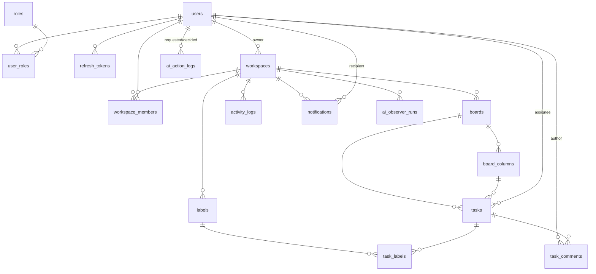

# TeamNexus – Tài liệu Thiết kế Database

> Tài liệu mô tả toàn bộ schema PostgreSQL cho dự án TeamNexus. Phạm vi phủ đủ 6 giai đoạn chức năng (Auth/RBAC, Kanban real-time, AI Smart Setup, Accountability Layer, AI Observer, Reporting).
>
> Các bảng thuộc **Giai đoạn 1 (Auth & Workspace)** được thiết kế chi tiết theo `tasks/phase-1-auth.md`. Các bảng thuộc **Giai đoạn 2–6** là thiết kế sơ bộ, sẽ được tinh chỉnh khi hiện thực từng giai đoạn; mỗi bảng đều gắn nhãn giai đoạn tương ứng theo `03-roadmap.md`.

---

## 1. Tổng quan

| Thành phần | Lựa chọn | Ghi chú |
|---|---|---|
| DBMS | PostgreSQL (Neon hoặc Supabase, serverless) | Free tier — theo dõi quota storage/compute |
| ORM | EF Core Code-First (Npgsql) | Migration bằng `dotnet ef migrations` |
| Kiến trúc | Modular Monolith | Module `Auth`, `Board`, `Ai`, `Reporting` |
| Khóa chính | `Guid` (UUID) cho mọi entity | Sinh ở app layer |
| Quy ước đặt tên | `snake_case` cho bảng/cột | Map từ entity PascalCase qua EF Core config |
| Timestamp | `timestamptz` | `created_at`/`updated_at`; thêm cột riêng ở chỗ cần |
| Enum | Cột `text` + `CHECK` constraint | Map sang .NET enum lưu dạng string; không dùng native ENUM type |
| Soft delete | Cột `deleted_at` (nullable) + global query filter | Cho workspace/board/column/task/comment |
| JSON linh hoạt | `jsonb` | Chỉ cho payload động (AI basis, snapshot, activity payload) |

### 1.1 DbContext & Migration

Khuyến nghị dùng **một DbContext duy nhất** để giữ **một chuỗi migration**:

```csharp
public class TeamNexusDbContext : IdentityDbContext<ApplicationUser, IdentityRole<Guid>, Guid>
{
    // DbSet cho toàn bộ domain entity
}
```

- Thay thế tên `AuthDbContext` trong `tasks/phase-1-auth.md` §2.1 bằng DbContext hợp nhất `TeamNexusDbContext` (kế thừa `IdentityDbContext`), chứa cả entity Identity lẫn domain entity để tránh cross-context FK và giữ migration đơn giản cho solo/free-tier.
- **Phương án thay thế** (không chọn ở giai đoạn này): mỗi module một DbContext + một "migration context" chung. Tradeoff: tách module sạch hơn nhưng phức tạp quản lý migration và FK giữa các module — chưa cần thiết ở quy mô hiện tại.

### 1.2 Quy ước chung

- Tên bảng/cột viết thường, phân tách bằng `_` (ví dụ `workspace_members`, `created_at`).
- Mọi entity đều có `id` kiểu `uuid` (PK).
- Mọi entity nghiệp vụ (không phải bảng junction thuần) có `created_at`; phần lớn có `updated_at` (đặt tự động ở app layer hoặc `SaveChanges` override).
- Không dùng cascade delete vật lý mặc định ở cấp DB; việc xóa tuân theo soft delete (`deleted_at`) hoặc ràng buộc app layer.
- `jsonb` chỉ dùng cho dữ liệu động; dữ liệu cần truy vấn/lọc phải tách thành cột quan hệ.

---

## 2. Sơ đồ quan hệ (ERD)



Quan hệ chính:
- Một `workspace` có nhiều `board`; mỗi `board` thuộc đúng một `workspace`.
- Một `workspace` có nhiều `workspace_members`; vai trò (`Admin`/`Manager`/`Member`) lưu trên từng membership.
- Một `board` có nhiều `board_columns`; mỗi `task` nằm trong một `board_columns` (trạng thái hiện tại).
- `task` có thể gắn nhiều `labels` qua bảng junction `task_labels`.
- Mọi hành động ghi dữ liệu do AI khởi tạo đều qua `ai_action_logs` (Accountability Layer).

---

## 3. Chi tiết bảng theo module

> Ký hiệu cột: **PK** = khóa chính, **FK** = khóa ngoại, **UQ** = unique, **IX** = index.

### 3.1 Module Auth — Bảng Identity (Giai đoạn 1)

Các bảng Identity của ASP.NET Core được đổi tên sang `snake_case`:

| Tên bảng gốc (Identity) | Tên trong schema |
|---|---|
| `AspNetUsers` | `users` |
| `AspNetRoles` | `roles` |
| `AspNetUserRoles` | `user_roles` |
| `AspNetUserLogins` | `user_logins` |
| `AspNetUserClaims` | `user_claims` |
| `AspNetRoleClaims` | `role_claims` |
| `AspNetUserTokens` | `user_tokens` |

#### `users`
Entity `ApplicationUser` kế thừa `IdentityUser<Guid>`, thêm các field nghiệp vụ.

| Cột | Kiểu | Null | Ràng buộc | Ghi chú |
|---|---|---|---|---|
| `id` | uuid | — | PK | |
| `user_name` | text | — | UQ | Identity chuẩn |
| `normalized_user_name` | text | — | UQ (index) | Identity chuẩn |
| `email` | text | — | UQ | Identity chuẩn |
| `normalized_email` | text | — | UQ (index) | Identity chuẩn |
| `email_confirmed` | bool | — | | Identity chuẩn |
| `password_hash` | text | null | | Identity chuẩn (không dùng cho OAuth-only nhưng giữ chuẩn) |
| `security_stamp` | text | — | | Identity chuẩn |
| `concurrency_stamp` | text | — | | Identity chuẩn |
| `phone_number` | text | null | | Identity chuẩn |
| `phone_number_confirmed` | bool | — | | Identity chuẩn |
| `two_factor_enabled` | bool | — | | Identity chuẩn |
| `lockout_end` | timestamptz | null | | Identity chuẩn |
| `lockout_enabled` | bool | — | | Identity chuẩn |
| `access_failed_count` | int | — | | Identity chuẩn |
| `display_name` | text | — | | Field mở rộng (theo phase-1 §2.1) |
| `avatar_url` | text | null | | Field mở rộng (ảnh từ OAuth provider) |
| `created_at` | timestamptz | — | | Field mở rộng |

#### `roles`
`IdentityRole<Guid>`.

| Cột | Kiểu | Null | Ràng buộc | Ghi chú |
|---|---|---|---|---|
| `id` | uuid | — | PK | |
| `name` | text | — | UQ | `Admin` / `Manager` / `Member` |
| `normalized_name` | text | — | UQ (index) | |
| `concurrency_stamp` | text | — | | |

Seed 3 role khi migrate: `Admin`, `Manager`, `Member`.

#### `user_roles`
`IdentityUserRole<Guid>`.

| Cột | Kiểu | Null | Ràng buộc | Ghi chú |
|---|---|---|---|---|
| `user_id` | uuid | — | PK (composite), FK→`users` | |
| `role_id` | uuid | — | PK (composite), FK→`roles` | |

#### `user_logins`
`IdentityUserLogin<Guid>` — lưu thông tin đăng nhập ngoài (Google/GitHub).

| Cột | Kiểu | Null | Ràng buộc | Ghi chú |
|---|---|---|---|---|
| `login_provider` | text | — | PK (composite) | `Google` / `GitHub` |
| `provider_key` | text | — | PK (composite) | Sub/ID từ provider |
| `provider_display_name` | text | null | | |
| `user_id` | uuid | — | FK→`users` | |

#### `user_claims`, `role_claims`, `user_tokens`
Giữ cấu trúc chuẩn Identity (`UserClaim`/`RoleClaim`/`UserToken`), đổi tên snake_case. `user_tokens` dùng cho flow password/two-factor nếu cần (không bắt buộc với OAuth-only nhưng giữ chuẩn).

### 3.2 Module Auth — Refresh Token (Giai đoạn 1)

#### `refresh_tokens`

| Cột | Kiểu | Null | Ràng buộc | Ghi chú |
|---|---|---|---|---|
| `id` | uuid | — | PK | |
| `user_id` | uuid | — | FK→`users`, IX | |
| `token_hash` | text | — | | SHA-256 của token thô (không lưu token gốc) |
| `expires_at` | timestamptz | — | | Mặc định 7 ngày |
| `created_at` | timestamptz | — | | |
| `revoked_at` | timestamptz | null | | Set khi revoke (logout/rotate) |
| `replaced_by_token_id` | uuid | null | FK→`refresh_tokens` (self) | Token thay thế trong flow rotate |

> **Ghi chú thiết kế:** dùng `replaced_by_token_id` (self-FK) thay cho field `ReplacedByToken` dạng hash ở `phase-1-auth.md` §2.1 — giúp truy vết chuỗi rotate rõ ràng hơn và chống replay; nếu cần giữ đúng nguyên văn phase-1 có thể thay bằng cột `replaced_by_token` (hash). Rotate = revoke token cũ (`revoked_at`) + tạo token mới trỏ ngược qua `replaced_by_token_id`.

### 3.3 Module Workspace & Membership (Giai đoạn 1)

#### `workspaces`

| Cột | Kiểu | Null | Ràng buộc | Ghi chú |
|---|---|---|---|---|
| `id` | uuid | — | PK | |
| `name` | text | — | | |
| `description` | text | null | | |
| `owner_id` | uuid | — | FK→`users`, IX | Người sở hữu workspace |
| `created_at` | timestamptz | — | | |
| `updated_at` | timestamptz | — | | |
| `deleted_at` | timestamptz | null | | Soft delete |

#### `workspace_members`
Bảng junction giữa workspace và user, mang vai trò **theo từng workspace** (lớp phân quyền thứ hai, song song với Identity role toàn cục).

| Cột | Kiểu | Null | Ràng buộc | Ghi chú |
|---|---|---|---|---|
| `workspace_id` | uuid | — | PK (composite), FK→`workspaces` | |
| `user_id` | uuid | — | PK (composite), FK→`users` | |
| `role` | text | — | CHECK (`role` IN ('Admin','Manager','Member')) | Vai trò trong workspace này |
| `joined_at` | timestamptz | — | | |

> **Mô hình phân quyền hai lớp:** `roles` + `user_roles` (Identity) quản lý vai trò **toàn cục** đưa vào claim JWT cho Policy-based authorization; `workspace_members.role` quản lý vai trò **trong phạm vi workspace** (một user có thể là `Admin` ở workspace A nhưng chỉ là `Member` ở workspace B). Composite PK đảm bảo một user chỉ có một vai trò duy nhất trong một workspace.

### 3.4 Module Kanban — Board (Giai đoạn 2)

#### `boards`

| Cột | Kiểu | Null | Ràng buộc | Ghi chú |
|---|---|---|---|---|
| `id` | uuid | — | PK | |
| `workspace_id` | uuid | — | FK→`workspaces`, IX | |
| `name` | text | — | | |
| `description` | text | null | | |
| `created_at` | timestamptz | — | | |
| `updated_at` | timestamptz | — | | |
| `deleted_at` | timestamptz | null | | Soft delete |

#### `board_columns`
Cột Kanban (trạng thái) của một board.

| Cột | Kiểu | Null | Ràng buộc | Ghi chú |
|---|---|---|---|---|
| `id` | uuid | — | PK | |
| `board_id` | uuid | — | FK→`boards`, IX | |
| `name` | text | — | | Ví dụ: To Do / In Progress / Done |
| `position` | int | — | UQ `(board_id, position)` | Thứ tự hiển thị cột |
| `created_at` | timestamptz | — | | |
| `updated_at` | timestamptz | — | | |

#### `tasks`

| Cột | Kiểu | Null | Ràng buộc | Ghi chú |
|---|---|---|---|---|
| `id` | uuid | — | PK | |
| `board_id` | uuid | — | FK→`boards`, IX | Để nhóm SignalR theo board & truy vấn nhanh |
| `column_id` | uuid | — | FK→`board_columns`, IX | Trạng thái hiện tại của task |
| `title` | text | — | | |
| `description` | text | null | | |
| `position` | int | — | IX `(board_id, column_id, position)` | Thứ tự task trong cột |
| `assignee_id` | uuid | null | FK→`users`, IX | Người phụ trách (MVP: 1 assignee) |
| `due_date` | timestamptz | null | | Hạn hoàn thành |
| `priority` | text | null | CHECK (`priority` IN ('Low','Medium','High','Urgent')) | Độ ưu tiên |
| `created_by` | uuid | — | FK→`users` | Người tạo task |
| `created_at` | timestamptz | — | | |
| `updated_at` | timestamptz | — | | |
| `completed_at` | timestamptz | null | | Set khi task vào cột Done |
| `deleted_at` | timestamptz | null | | Soft delete |

> **Ghi chú thiết kế:**
> - Giữ cả `board_id` (cho SignalR group theo board + query theo board) lẫn `column_id` (trạng thái hiện tại). Tính nhất quán (`task.board_id == task.column.board_id`) do app layer đảm bảo.
> - MVP dùng **một assignee** (`assignee_id`). Hỗ trợ đa người phụ trách (bảng `task_assignees`) để dành giai đoạn sau nếu cần.
> - Cập nhật đồng thời chấp nhận chiến lược **last-write-wins** (theo `02-tech-stack-decisions.md` §2.2).

#### `labels`
Nhãn gắn cho task, phạm vi theo workspace.

| Cột | Kiểu | Null | Ràng buộc | Ghi chú |
|---|---|---|---|---|
| `id` | uuid | — | PK | |
| `workspace_id` | uuid | — | FK→`workspaces`, UQ `(workspace_id, name)` | |
| `name` | text | — | | |
| `color` | text | — | | Mã màu (hex, ví dụ `#3B82F6`) |
| `created_at` | timestamptz | — | | |

#### `task_labels`
Junction giữa task và label.

| Cột | Kiểu | Null | Ràng buộc | Ghi chú |
|---|---|---|---|---|
| `task_id` | uuid | — | PK (composite), FK→`tasks` | |
| `label_id` | uuid | — | PK (composite), FK→`labels` | |

#### `task_comments`
Bình luận trên task — đồng thời là nguồn "bối cảnh giao tiếp" cho AI Observer.

| Cột | Kiểu | Null | Ràng buộc | Ghi chú |
|---|---|---|---|---|
| `id` | uuid | — | PK | |
| `task_id` | uuid | — | FK→`tasks`, IX | |
| `author_id` | uuid | — | FK→`users`, IX | |
| `content` | text | — | | |
| `created_at` | timestamptz | — | | |
| `updated_at` | timestamptz | — | | |
| `deleted_at` | timestamptz | null | | Soft delete |

### 3.5 Module AI — Accountability Layer (Giai đoạn 4)

#### `ai_action_logs`
Vết dữ liệu cho **mọi hành động AI ghi dữ liệu** (theo `02` §2.4 và `03-roadmap.md` giai đoạn 4).

| Cột | Kiểu | Null | Ràng buộc | Ghi chú |
|---|---|---|---|---|
| `id` | uuid | — | PK | |
| `action` | text | — | | Loại hành động (xem bộ giá trị gợi ý ở §4) |
| `entity_type` | text | — | | Loại entity bị tác động (ví dụ `Task`) |
| `entity_id` | uuid | null | | Id entity bị tác động (nếu đã sinh) |
| `basis` | jsonb | — | | Tóm tắt prompt/dữ liệu đầu vào (cơ sở của hành động) |
| `before_snapshot` | jsonb | null | | Dữ liệu trước khi áp dụng (dùng để revert/undo) |
| `after_snapshot` | jsonb | null | | Dữ liệu đề xuất (sẽ áp dụng khi được duyệt) |
| `status` | text | — | CHECK (`status` IN ('Pending','Approved','Rejected','Undone')) | Trạng thái vòng đời |
| `requested_by_user_id` | uuid | — | FK→`users`, IX | Người khởi tạo yêu cầu AI |
| `decided_by_user_id` | uuid | null | FK→`users` | Người duyệt/từ chối/undo |
| `decided_at` | timestamptz | null | | Thời điểm ra quyết định |
| `created_at` | timestamptz | — | | |
| `updated_at` | timestamptz | — | | |

> **Luồng:** AI tạo log ở trạng thái `Pending` (chưa ghi dữ liệu thật) → người dùng `Approved` (áp dụng `after_snapshot`) hoặc `Rejected` → sau này có thể `Undone` (revert về `before_snapshot`). Mọi hành động AI ghi dữ liệu phải đi qua service `AiActionService` duy nhất.

### 3.6 Module AI — Observer (Giai đoạn 5)

#### `activity_logs`
Nguồn "log hệ thống" cho Observer quét định kỳ.

| Cột | Kiểu | Null | Ràng buộc | Ghi chú |
|---|---|---|---|---|
| `id` | uuid | — | PK | |
| `workspace_id` | uuid | — | FK→`workspaces`, IX `(workspace_id, created_at)` | |
| `board_id` | uuid | null | FK→`boards` | |
| `user_id` | uuid | null | FK→`users` | Actor (nếu có) |
| `entity_type` | text | — | | Loại entity (ví dụ `Task`, `Comment`) |
| `entity_id` | uuid | null | | Id entity |
| `action` | text | — | | `TaskCreated` / `TaskMoved` / `TaskCompleted` / … |
| `payload` | jsonb | null | | Chi tiết sự kiện (trạng thái trước/sau, …) |
| `created_at` | timestamptz | — | | |

#### `notifications`
Cảnh báo gửi **riêng cho Manager** (không public toàn team).

| Cột | Kiểu | Null | Ràng buộc | Ghi chú |
|---|---|---|---|---|
| `id` | uuid | — | PK | |
| `workspace_id` | uuid | — | FK→`workspaces` | |
| `recipient_user_id` | uuid | — | FK→`users`, IX `(recipient_user_id, is_read)` | Manager nhận cảnh báo |
| `type` | text | — | | `Bottleneck` / `Overload` / `ConflictPotential` / `OverdueTask` / … |
| `title` | text | — | | |
| `message` | text | — | | |
| `payload` | jsonb | null | | Chi tiết cảnh báo (danh sách task/user liên quan, …) |
| `is_read` | bool | — | default false | |
| `created_at` | timestamptz | — | | |
| `read_at` | timestamptz | null | | |

#### `ai_observer_runs`
Ghi lại mỗi lần chạy nền của Observer (chống cảnh báo trùng lặp, phục vụ audit).

| Cột | Kiểu | Null | Ràng buộc | Ghi chú |
|---|---|---|---|---|
| `id` | uuid | — | PK | |
| `workspace_id` | uuid | — | FK→`workspaces`, IX | |
| `started_at` | timestamptz | — | | |
| `finished_at` | timestamptz | null | | |
| `status` | text | — | | `Running` / `Completed` / `Failed` |
| `summary` | jsonb | null | | Tổng kết lần chạy (tín hiệu phát hiện, token đã dùng, …) |

### 3.7 Module Reporting (Giai đoạn 6)

**Không tạo bảng lưu trữ.** File PDF (QuestPDF) / Excel (ClosedXML) được **generate on-demand** và không lưu lâu dài trên server (theo `02-tech-stack-decisions.md` §2.5). Dữ liệu báo cáo được tổng hợp trực tiếp từ `tasks`, `board_columns`, `activity_logs` tại thời điểm yêu cầu.

---

## 4. Enum & giá trị hợp lệ

| Enum | Lưu trữ | Giá trị hợp lệ | Áp dụng tại |
|---|---|---|---|
| Identity role (toàn cục) | `roles.name` | `Admin`, `Manager`, `Member` | `roles`, `user_roles`, claim JWT |
| `WorkspaceRole` | `text` + CHECK | `Admin`, `Manager`, `Member` | `workspace_members.role` |
| `TaskPriority` | `text` + CHECK | `Low`, `Medium`, `High`, `Urgent` | `tasks.priority` |
| `AiActionStatus` | `text` + CHECK | `Pending`, `Approved`, `Rejected`, `Undone` | `ai_action_logs.status` |
| `AiActionType` | `text` (tự do, bộ gợi ý) | `CreateSubtasks`, `AssignMember`, `SetLabels`, `MoveTasks`, … | `ai_action_logs.action` |
| `ActivityAction` | `text` (tự do, bộ gợi ý) | `TaskCreated`, `TaskMoved`, `TaskCompleted`, `TaskDeleted`, `CommentAdded`, … | `activity_logs.action` |
| `NotificationType` | `text` (tự do, bộ gợi ý) | `Bottleneck`, `Overload`, `ConflictPotential`, `OverdueTask`, … | `notifications.type` |
| `ObserverRunStatus` | `text` | `Running`, `Completed`, `Failed` | `ai_observer_runs.status` |

> Nguyên tắc: enum có tập giá trị cố định (role, priority, status) dùng `CHECK`; enum dự kiến mở rộng (action type, notification type) dùng `text` tự do kèm bộ giá trị gợi ý để không phải sửa constraint mỗi lần thêm loại mới.

---

## 5. Chỉ mục & hiệu năng

| Bảng | Index | Loại | Mục đích |
|---|---|---|---|
| `refresh_tokens` | `user_id` | IX | Tra cứu token theo user |
| `workspace_members` | `(workspace_id, user_id)` | PK | Đảm bảo vai trò duy nhất/workspace |
| `boards` | `workspace_id` | IX | Liệt kê board theo workspace |
| `board_columns` | `(board_id, position)` | UQ | Thứ tự cột, chống trùng vị trí |
| `tasks` | `board_id` | IX | Query task theo board (SignalR group) |
| `tasks` | `column_id` | IX | Query task theo cột |
| `tasks` | `(board_id, column_id, position)` | IX | Sắp xếp kéo-thả trong cột |
| `tasks` | `assignee_id` | IX | Lọc task theo người phụ trách |
| `labels` | `(workspace_id, name)` | UQ | Tên nhãn duy nhất trong workspace |
| `task_comments` | `task_id` | IX | Liệt kê bình luận theo task |
| `ai_action_logs` | `requested_by_user_id` | IX | Liệt kê hành động AI theo người yêu cầu |
| `activity_logs` | `(workspace_id, created_at)` | IX | Observer quét theo chu kỳ |
| `notifications` | `(recipient_user_id, is_read)` | IX | Lấy cảnh báo chưa đọc của Manager |
| `ai_observer_runs` | `workspace_id` | IX | Audit theo workspace |

---

## 6. Chiến lược Migration

- Code-First: entity → `dotnet ef migrations add <Tên>` → `dotnet ef database update`.
- Một chuỗi migration duy nhất từ `TeamNexusDbContext` (xem §1.1).
- Seed dữ liệu nền trong migration/`OnModelCreating`: 3 role `Admin`, `Manager`, `Member`.
- Migration áp dụng lên PostgreSQL local để dev, sau đó lên Neon/Supabase (theo `phase-1-auth.md` §2.1).

---

## 7. Toàn vẹn dữ liệu, edge cases & failure modes

- **Refresh token rotate:** khi refresh, token cũ phải `revoked_at` ngay và token mới trỏ `replaced_by_token_id` về token cũ. Nếu một token đã revoke được sử dụng lại → phát hiện replay (revoke cả chuỗi con nếu cần) và trả `401`.
- **Soft delete vs Undo:** `deleted_at` dùng để ẩn/phục hồi entity trong UI (workspace/board/column/task/comment). Undo cho **hành động AI** dùng `before_snapshot` trong `ai_action_logs` (revert dữ liệu đã áp dụng). Hai cơ chế này khác nhau và không thay thế lẫn nhau.
- **Kanban đồng thời:** cập nhật `position`/`column_id` có thể xung đột giữa các client; chấp nhận **last-write-wins** ở giai đoạn này, client dùng optimistic update và đồng bộ lại khi server xác nhận (theo `02` §2.2).
- **AI Smart Setup:** output JSON phải validate đúng schema trước khi ghi DB; không ghi thẳng — luôn qua `ai_action_logs` ở `Pending` rồi mới áp dụng (theo `02` §2.3).
- **JSONB:** `basis`, `before/after_snapshot`, `payload`, `summary` chứa dữ liệu động; không dùng thay thế cột quan hệ cần lọc/truy vấn.
- **Free-tier quota:** Neon/Supabase giới hạn storage/compute — không lưu file report lâu dài; cần chính sách retention cho `activity_logs` (ghi chú: dọn log cũ định kỳ để không phình quota).
- **Nhất quán `tasks.board_id` / `tasks.column_id`:** app layer phải đảm bảo task luôn thuộc cột thuộc đúng board; khuyến nghị validate ở service thay vì trigger để giữ logic tập trung.
- **Cascade delete:** không dùng cascade vật lý; việc xóa workspace/board phải xử lý mềm (soft delete) và cân nhắc chính sách xóa các entity con.

---

## 8. Giả định & tham chiếu

**Giả định chính:**
- Dữ liệu văn bản (name/description/title/content) không giới hạn độ dài cứng ở cấp DB trong tài liệu này; sẽ ràng buộc `varchar(n)`/`maxLength` cụ thể khi hiện thực nếu cần.
- MVP dùng 1 assignee/task; đa assignee để giai đoạn sau.
- Bảng giai đoạn 2–6 là thiết kế sơ bộ, có thể thay đổi khi hiện thực từng giai đoạn.

**Tài liệu nguồn:**
- `Project-Documents/01-system-specification.md`
- `Project-Documents/02-tech-stack-decisions.md`
- `Project-Documents/03-roadmap.md`
- `Project-Documents/tasks/phase-1-auth.md`
